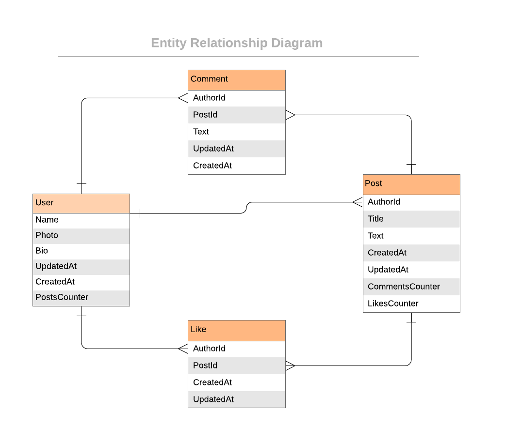

<h2><b>Rails Blog App 1</b></h2>

<a name="readme-top"></a>

<!-- TABLE OF CONTENTS -->

# 📗 Table of Contents
- [📖 About the Project](#about-project)
  - [🛠 Built With](#built-with)
    - [Tech Stack](#tech-stack)
    - [Key Features](#key-features)
- [💻 Getting Started](#getting-started)
  - [Setup](#setup)
  - [Prerequisites](#prerequisites)
  - [Usage](#usage)
  - [install](#install)
- [👥 Authors](#authors)
- [🔭 Future Features](#future-features)
- [🤝 Contributing](#contributing)
- [⭐️ Show your support](#support)
- [🙏 Acknowledgements](#acknowledgements)
- [📝 License](#license)

# 📖 Blog App <a name="about-project"></a>

**Blog App** The Blog app is classic example of a blog website. A fully functional website that will show the list of posts and empower readers to interact with them by adding comments and liking posts.

## 🛠 Built With <a name="built-with"></a>

### Tech Stack <a name="tech-stack"></a>

This project was implemented using:

<details>
  <summary>Framework</summary>
  <ul>
    <li><a href="https://rubyonrails.org/">Ruby on Rails</a></li>
  </ul>
</details>

<details>
<summary>Database</summary>
  <ul>
    <li><a href="https://www.postgresql.org/">PostgreSQL</a></li>
  </ul>
</details>

### Key Features <a name="key-features"></a>

- **Can persist user data to database**
- **Can persist posts data to database**
- **Can persist comments and likes database**

<p align="right">(<a href="#readme-top">back to top</a>)</p>

## 💻 Getting Started <a name="getting-started"></a>

To get a local copy up and running, follow these steps:

### Prerequisites

In order to run this project you need to have installed:

- [ ] install ruby

- [ ] install postgresql

- [ ] You’ll need to have Ruby and Rails on your machine.

Optionally, in order to modify this project you should to have installed:

- [ ] Git.

- [ ] Code editor like: [Visual Studio code](https://code.visualstudio.com/), or others...

### Setup

To clone this repository to your desired folder:

- You can download the **Zip** file from the GitHub repository, or clone the repository with:

```console
git clone https://github.com/ivanmvh/Blog.git
```

- Access the cloned directory with:

```console
cd Blog-App
```

- Open it with your favorite code editor or with the live server

### Install

To run the project, execute the following command in the project directory:

```console
    bundle install
    rails db:create
    rails db:migrate
```
### Usage

To run the project, execute the following command in the project directory:

```console
rails server
```
<p align="right">(<a href="#readme-top">back to top</a>)</p>


## 👥 Authors <a name="authors"></a>

👤 **Ivan Martinez von Halle**

- GitHub: [@ivanmvh](https://github.com/ivanmvh)
- Twitter: [@imprivado](https://twitter.com/imprivado)
- LinkedIn: [LinkedIn](https://www.linkedin.com/in/ivan-martinez-von-halle/)

<p align="right">(<a href="#readme-top">back to top</a>)</p>

## 🔭 Future Features <a name="future-features"></a>

We will implement this on the future:

- [ ]  2: Controllers specs.
- [ ]  3: Creating a data model.
- [ ]  4: Processing data in models.
- [ ]  5: Views.
- [ ]  6: Forms
- [ ]  7: Validations, Model specs, and n+1 problems.
- [ ]  8: Add Devise.
- [ ]  9: Add authorization rules.
- [ ]  10: Integration specs for Views.
- [ ]  11: Add API endpoints.
- [ ]  Exercise: API documentation.

<p align="right">(<a href="#readme-top">back to top</a>)</p>

## 🤝 Contributing <a name="contributing"></a>

Contributions, issues, and feature requests are welcome!

Feel free to check the [issues page](https://github.com/ivanmvh/Blog/issues).

<p align="right">(<a href="#readme-top">back to top</a>)</p>

## ⭐️ Show your support <a name="support"></a>

Give a ⭐️ if you like this project!

<p align="right">(<a href="#readme-top">back to top</a>)</p>

## 🙏 Acknowledgments <a name="acknowledgements"></a>

- Microverse 

<p align="right">(<a href="#readme-top">back to top</a>)</p>

## 📝 License <a name="license"></a>

This project is [MIT](./LICENSE) licensed.

<p align="right">(<a href="#readme-top">back to top</a>)