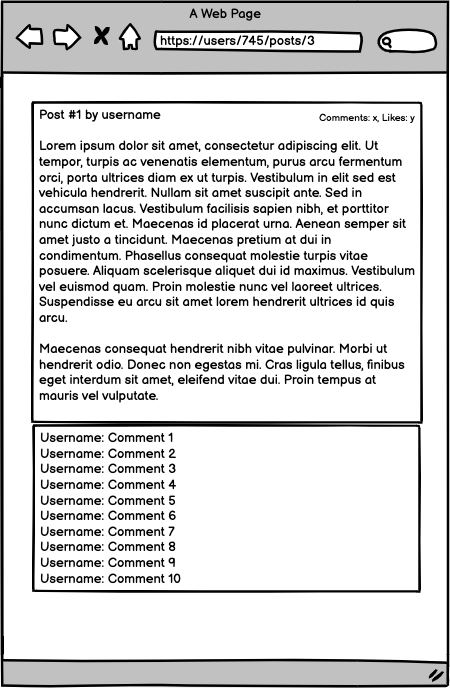

# Blog app - controllers
In this project, we will create all controllers and views for our Blog app. As we won't be processing any data yet, we will add simple placeholders for our views with plain HTML.

- - ### Learning objectives
- Use controllers to handle requests and render empty views.
- Understand Rails naming conventions.
- Use params from browser requests in a safe way.

### Project requirements
-  **Important:** we do NOT use `rails generate scaffold` command. The point of this project is to show we how to set up controllers by ourself.
-  Take a look at the wireframes below. Make sure that our app handles the URLs used in the wireframes:  

  
  
  
  

-  For each URL we should create:
    - A route.
    - An action in the correct controller.
    - A view file.

-  View files should include only placeholders written in plain HTML, e.g:
    - Here is a list of posts for a given user

-  Make sure that we added code to handle **only** the 4 required URLs.

###### Make sure that when we run the `rails routes` command in our console, we can see the following output:

### General requirements (Don't forget)
- Make sure that there are no linter errors.
- Make sure that we used correct flow Gitflow.
- Make sure that we documented our work in a professional way.
- Follow our list of best practices for Ruby.

@ivanmvh